# Screenshots

Generated by the [Screenshots workflow](../.github/workflows/screenshots.yml)
from the pages in `examples/` at commit `e12f767` (2026-07-28 23:21 UTC).
Do not edit by hand — the workflow rewrites this file whenever the theme or
the examples change on `main`.

| Page | Dark | Light |
| --- | --- | --- |
| Overview | 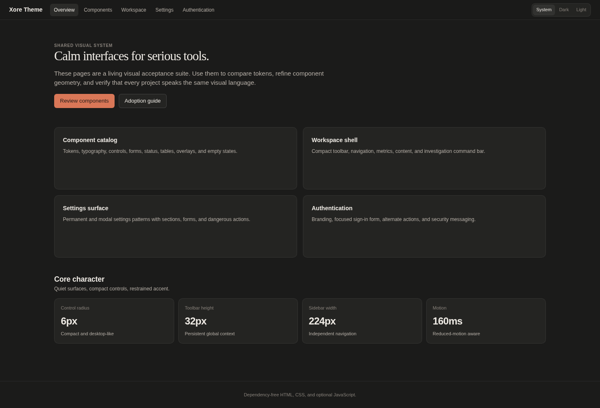 | 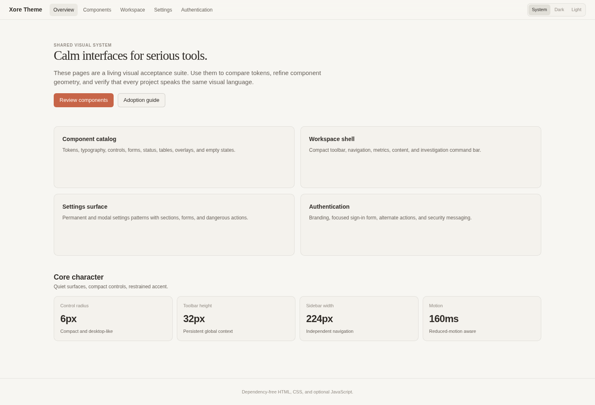 |
| Component catalog | 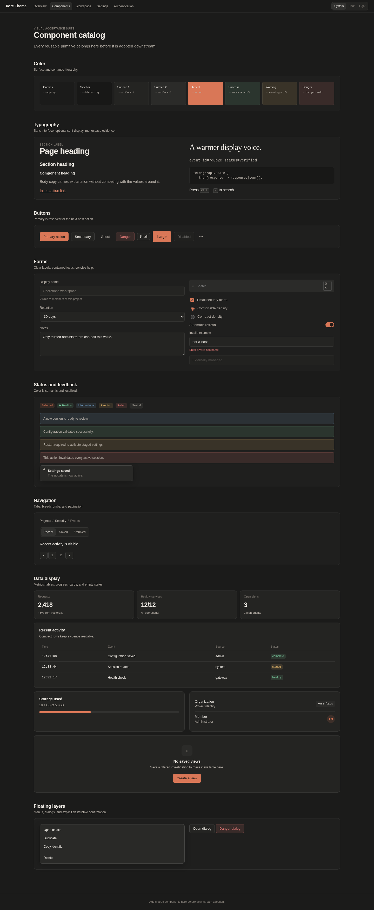 | 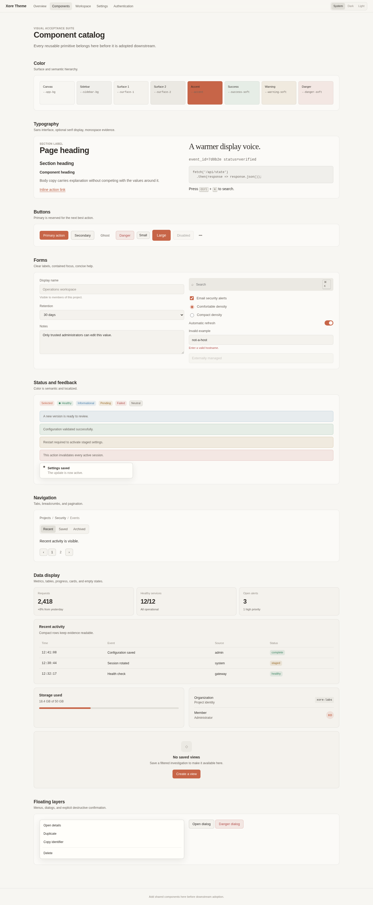 |
| Settings | 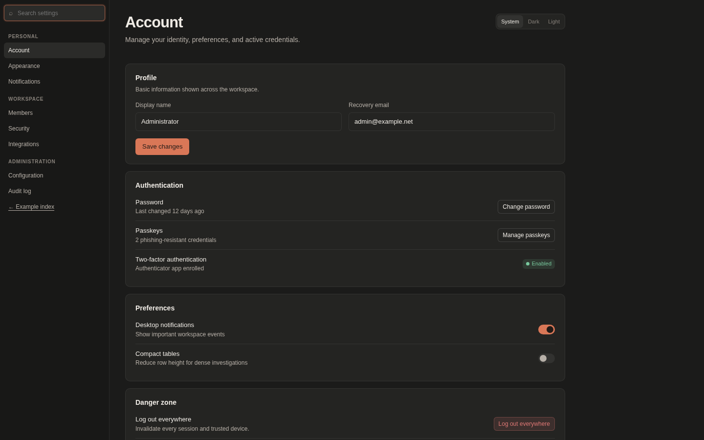 | 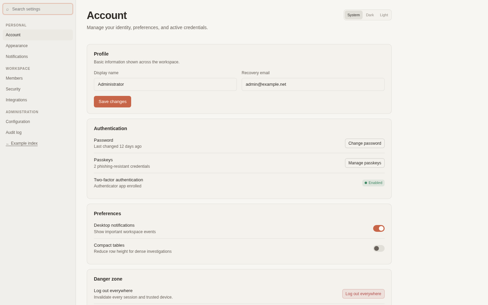 |
| Workspace shell | 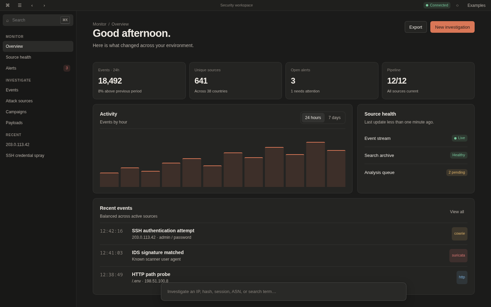 | 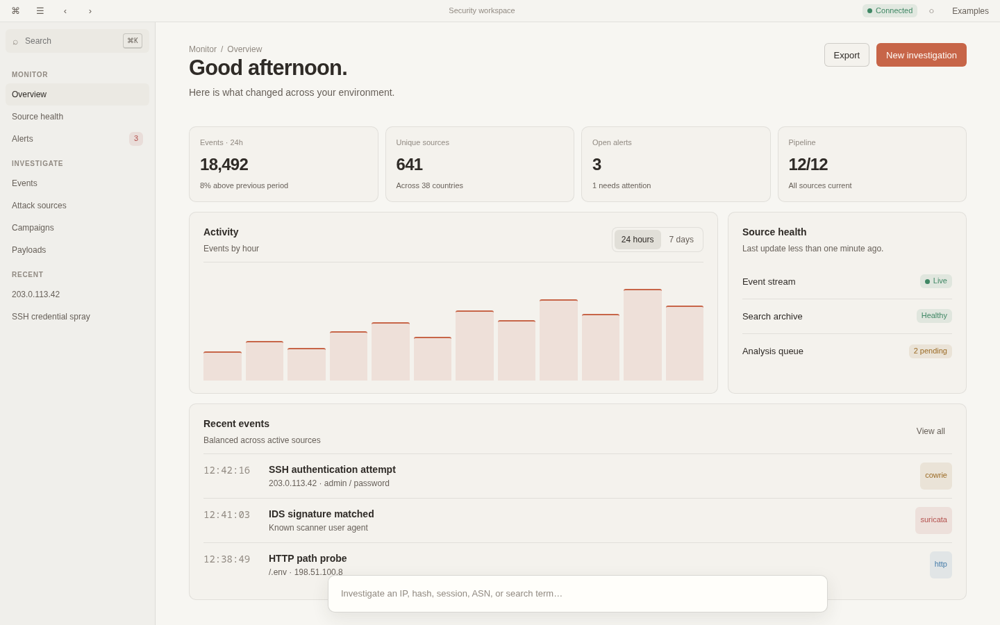 |
| Authentication | 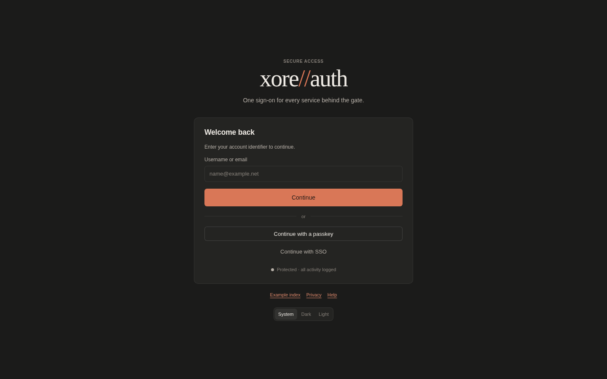 | 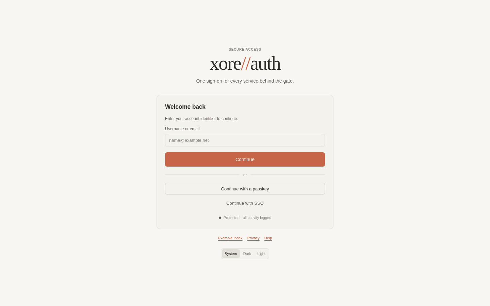 |

## Responsive

The workspace shell at a 390px viewport, dark mode:

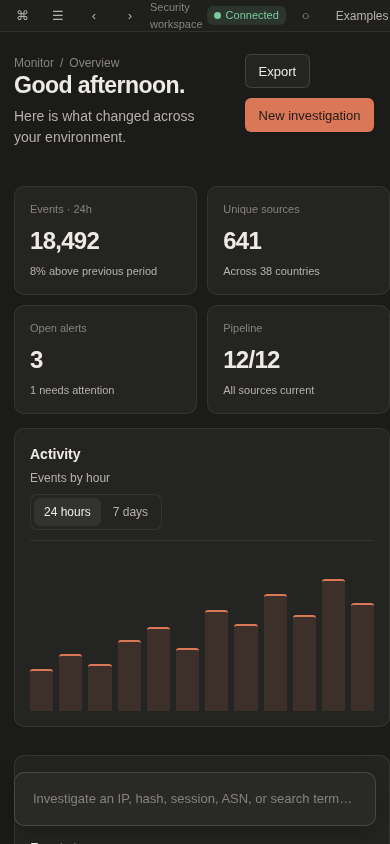
